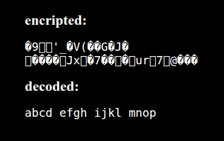
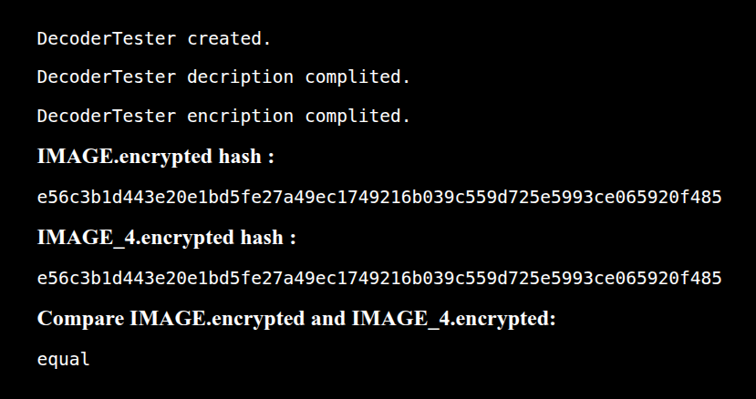
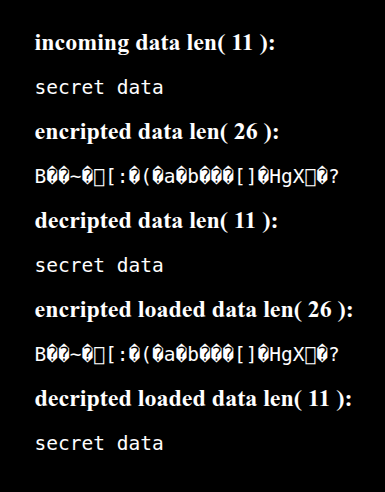

# PSR-7 Encription / Decription decorator


## Required PHP v8.x
Checked on PHP v8.2

## Install (coming soon):
```sh
composer require dev-phoenix/psr7-decorator
```

## Exemples:
```php
require_once 'vendor/autoload.php';

use GuzzleHttp\Psr7\Stream;
use DevPhoenix\Psr7Decorator\StreamDecoratorDecode;
use DevPhoenix\Psr7Decorator\StreamDecoratorEncode;
use DevPhoenix\Psr7Decorator\pre;

$out_dir_name = '/results'; // needs already be created
$parent_dir = dirname(__FILE__);
$out_dir = $parent_dir . $out_dir_name;

$mediaKey = 'secret key';

$test_data = 'abcd efgh ijkl mnop';
file_put_contents($out_dir.'/orig_data.txt', $test_data);

// Encripting
$inStream = new Stream(fopen($out_dir.'/orig_data.txt', 'r')); // PSR-7 stream
$decoder = new StreamDecoratorEncode($inStream, $mediaKey); // add decorator
$encriptedresult = $decoder -> getContents();

H::pre($encriptedresult, 'encripted'); // output

// save intermediate data dump
file_put_contents($out_dir.'/enc_data.txt', $encriptedresult);

// Decription
$inStream = new Stream(fopen($out_dir.'/enc_data.txt', 'r')); // PSR-7 stream
$decoder = new StreamDecoratorDecode($inStream, $mediaKey); // add decorator
$originalresult = $decoder -> getContents();

H::pre($originalresult, 'decoded'); // output
```

Out:  


## Exemples with exemple files:
```php
require_once 'vendor/autoload.php';

use DevPhoenix\Psr7Decorator\DecoderTester;
use DevPhoenix\Psr7Decorator\pre;

// prepare sources dir parh
$src_dir_name = '/samples';
$out_dir_name = '/results';
$parent_dir = dirname(__FILE__);
$src_dir = $parent_dir . $src_dir_name;
$out_dir = $parent_dir . $out_dir_name;

// allowed file names which means file media type
$fname_D = 'DOCUMENT';
$fname_A = 'AUDIO';
$fname_I = 'IMAGE';
$fname_V = 'VIDEO';

// Cipher test class specially for files
$decoder = new DecoderTester($src_dir, $out_dir);
H::pre('DecoderTester created.');
$size = $decoder -> processDecription($fname_I, $fname_I.'_4', $src_dir, $out_dir);
H::pre('DecoderTester decription complited.');
$size = $decoder -> processEncription($fname_I, $fname_I.'_4', $src_dir, $out_dir);
H::pre('DecoderTester encription complited.');


// compare encripted files, origin encripted and generated encripted
$in_enc_fname = $src_dir . '/' . $fname_I.'' . '.encrypted';
$out_enc_fname = $out_dir . '/' . $fname_I.'_4' . '.encrypted';

$hashe_1 = hash_file('sha256', $in_enc_fname);
$hashe_2 = hash_file('sha256', $out_enc_fname);

$mess_1 = sprintf('%s ', $fname_I.'' . '.encrypted hash');
$mess_2 = sprintf('%s ', $fname_I.'_4' . '.encrypted hash');
$mess_3 = sprintf('Compare %s and %s', $fname_I.'' . '.encrypted', $fname_I.'_4' . '.encrypted');
H::pre($hashe_1, $mess_1);
H::pre($hashe_2, $mess_2);
H::pre(($hashe_1 == $hashe_2)?'equal':'not equal',$mess_3);
```

Out:  



## Exemples with simple string:
Only cipher without psr7
```php
require_once 'vendor/autoload.php';

use DevPhoenix\Psr7Decorator\Decoder;
use DevPhoenix\Psr7Decorator\pre;

$mediaKey = 'secret key';
$data = 'secret data';
$data_ = 'secret data';

$out_dir_name = '/results';
$parent_dir = dirname(__FILE__);
$out_dir = $parent_dir . $out_dir_name;


$decoder = new Decoder();
H::pre($data, sprintf('incoming data len( %s )',H::strSize(strlen($data))));
$data = $decoder -> processEncript($mediaKey, $data);
H::pre($data, sprintf('encripted data len( %s )',H::strSize(strlen($data))));

file_put_contents($out_dir.'/enc_f_data.txt', $data); // save cipher data
$data_ = file_get_contents($out_dir.'/enc_f_data.txt'); // load cipher data

$data = $decoder -> processDecript($mediaKey, $data_);
H::pre($data, sprintf('decripted data len( %s )',H::strSize(strlen($data))));

H::pre($data_, sprintf('encripted loaded data len( %s )',H::strSize(strlen($data_))));
$data = $decoder -> processDecript($mediaKey, $data_);
H::pre($data, sprintf('decripted loaded data len( %s )',H::strSize(strlen($data))));
```

Out:  

